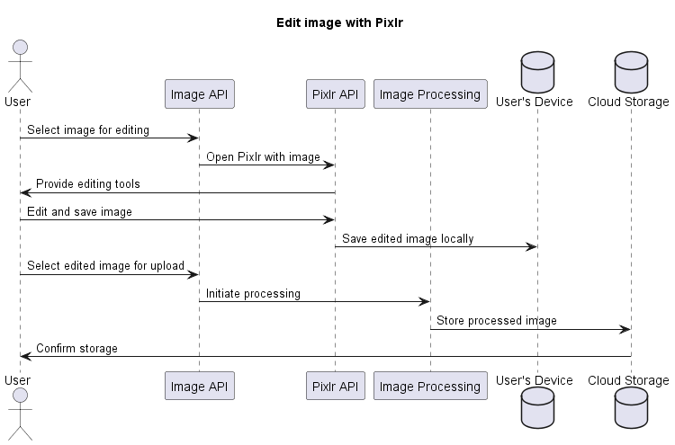
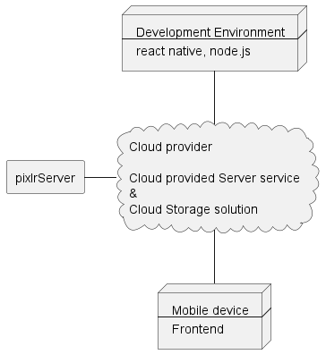

#

**About arc42**

arc42, the template for documentation of software and system
architecture.

Template Version 8.2 EN. (based upon AsciiDoc version), January 2023

Created, maintained and © by Dr. Peter Hruschka, Dr. Gernot Starke and
contributors. See <https://arc42.org>.

This version of the template contains some help and explanations. It is
used for familiarization with arc42 and the understanding of the
concepts. For documentation of your own system you use better the
_plain_ version.

 

# 1. Introduction and Goals

The following arc42 template deals with the architecture and documentation of an "Image Sharing App". We are a team of dedicated professionals, working for a regional technology company.

Team members are:

Alexander B.  
Alireza J.  
Carolin M.

## 1.1. Requirements Overview

**What is the Image Sharing App?**  
The main purpose is an image sharing app targeting photography enthusiasts and professionals, with a strong community aspect.

**Main features**

- Register and login
- Upload and share images
- Like images
- Comment on images
- Advanced editing through a third party integration with Pixlr
- Make, use and save custom image filters
- Social feed for following other users
- Free tier with limited features and subscription model for full access

The app must be able to handle a large concurrent user base.

## 1.2. Quality Goals

| Priority | Quality                     | Motivation                                                                                                                    |
| -------- | --------------------------- | ----------------------------------------------------------------------------------------------------------------------------- |
| 1        | [Usability](#Usability)     | The app must be user-friendly and easy to navigate The subscription model must be clearly communicated and easy to understand |
| 2        | [Reliability](#Reliability) | The app must be stable and function without significant bugs or errors                                                        |
| 3        | [Performance](#Performance) | The app must be optimized for [performance](#Performance) and load times                                                      |

## 1.3. Stakeholders

The following lists contains the most important personas for this application

| Role/Name                                                  | Expectations                                                                                                                                                                                                  |
| ---------------------------------------------------------- | ------------------------------------------------------------------------------------------------------------------------------------------------------------------------------------------------------------- |
| Marketing Manager, Sarah Chen, Bold Branding Agency        | Expecting that the features of the application match the needs of the market, that the app is attractive to the target audience so that commercialisation and marketing campaigns are successful.             |
| Project Manager, Michael Nguyen, Digital Dreams Inc.       | Expecting that the development of the app meets the timeframe and scope to manage deadlines, meetings and costs; Management of optimal use of resources; Focus on communication and collaboration of the team |
| Lead Developer, Ava Patel, Pixel Perfect Solutions         | High quality of application development, clear idea of the architecture, clear documentation; Prioritizing quality goals in application development;                                                          |
| UX/UI Designer, Emily Wong, Creative Co.                   | intuitive and attractive user interface with a focus on [usability](#Usability)                                                                                                                               |
| User Representative, Samir Singh, Photography Enthusiast   | easy and intuitive [usability](#Usability), users' wishes are fulfilled, high [reliability](#Reliability) (no crashes or errors)                                                                              |
| Photography Expert, Lucas Rodriguez, Snap & Shoot Magazine | Testing the application and ensuring that the specific features of the application meet the needs of professional photographers.                                                                              |

 

# 2. Architecture Constraints

| Constraints                 | Background and/or motivation                                                                                                                                       |
| --------------------------- | ------------------------------------------------------------------------------------------------------------------------------------------------------------------ |
| Storage and Data Management | Because of high-quality images, each user should have a memory limitation; Cloud based storage; Efficient Data retrieval: efficient search and retrieval of images |
| Multi-Language-support      | Because it is a regional project in Austria, it should support both german and english                                                                             |
| Third-party-integration     | The integration of the third-party service (Pixlr) puts some constraints on the features of the application, ensure efficient API management                       |
| Budgetary Limitations       | available budget constraints the scale of infrastructure, and the acquisition of third-party services                                                              |
| Platform Compatibility      | The application should work on IOS                                                                                                                                 |

 

# 3. System Scope and Context

## 3.1. Business Context

<table border="1">
    <tr>
        <th>Communication Partner</th>
        <th>Interfaces</th>
        <th>Inputs</th>
        <th>Outputs</th>
    </tr>
    <tr>
        <td>Users</td>
        <td>Mobile App, User Interface, social feed</td>
        <td>User credentials, image upload, comments, likes</td>
        <td>shared images, notifications</td>
    </tr>
    <tr>
        <td>IT-Systems (Pixlr)</td>
        <td>Pixlr Integration, Image Editing</td>
        <td>Image data, filter settings</td>
        <td>edited images, processing status</td>
    </tr>
    <tr>
        <td>Cloud provider</td>
        <td>Cloud Storage APIs</td>
        <td>Image storage and retrieval</td>
        <td>Scalable image storage solution</td>
    </tr>
    <tr>
        <td>Subscription System</td>
        <td>Payment Gateway, Subscription Management</td>
        <td>User subscriptions, payment details</td>
        <td>Full access permissions</td>
    </tr>
    <tr>
        <td>Social Media Platforms</td>
        <td>Social Media APIs</td>
        <td>User shared content</td>
        <td>Increased app visibility, user acquisition</td>
    </tr>
    <tr>
        <td>Marketing Manager</td>
        <td>Marketing Campaign, Analytics Integration</td>
        <td>Marketing data, campaign details</td>
        <td>user engagement data</td>
    </tr>
    <tr>
        <td>UX/UI Designer</td>
        <td>UI/UX Design, Design Tools</td>
        <td>Design mockups, User feedback</td>
        <td>UI/UX improvements, <a href="#Usability">usability</a> metrics</td>
    </tr>
</table>

## 3.2. Technical Context

  

# 4. Solution Strategy

<table border="1">
    <tr>
        <th>Goal/Requirements</th>
        <th>Architectural Approach</th>
    </tr>
    <tr>
        <td>Scalability</td>
        <td><a href="#Microservices">Microservices</a></td>
    </tr>
    <tr>
        <td><a href="#Performance">Performance</a></td>
        <td>Caching Strategies and <a href="#Content Delivery Network (CDN)">Content Delivery Networks (CDN)</a></td>
    </tr>
    <tr>
        <td><a href="#Reliability">Reliability</a></td>
        <td>Redundancy and <a href="#Load Balancing">Load Balancing</a></td>
    </tr>
</table>

 

# 5. Building Block View

## 5.1. Whitebox Overall System

 

**Contained blackboxes**

| Components       | Description                                                                                                                                                                                                  |
| ---------------- | ------------------------------------------------------------------------------------------------------------------------------------------------------------------------------------------------------------ |
| Image processing | The "Image Processing" component handles the retrieval, transmission, and processing of images, ensuring efficient and high-quality image manipulation.                                                      |
| User profile     | The "User Profile" component manages user account information, preferences, and settings, offering a personalized user experience.                                                                           |
| Notifications    | The "Notifications" component is responsible for generating and delivering alerts and messages to users based on their activities and preferences.                                                           |
| Images           | The "Images" component is dedicated to storing and retrieving image files, optimized for high-volume and large-size image data handling.                                                                     |
| User data        | The "User Data" component focuses on storing and managing user-specific data, including preferences, usage history, and personal information, ensuring data integrity and privacy                            |
| Image Metadata   | The "Image Metadata" component manages information related to images, such as tags, descriptions, and ownership details, facilitating efficient image categorization and searchability.                      |
| Data handling    | The "Data handling" component is the primary data handling solution, designed for robust, scalable, and secure handling of app data, including images and metadata and communicating with the cloud storage. |

 

**Interfaces**
| Interfaces | Description|
| --------------------------- | -------------------------------------------- |
|Image API| The "Image API" serves as an interface to interact with the image processing functionalities, enabling seamless integration and data exchange.|
|Pxlr API| The "Pixlr API" is integrated for advanced image editing and processing capabilities, enriching the app's image manipulation features.|
|User API | The "User API" provides a gateway to access and manage user profile data, ensuring a consistent and secure user data handling.|
|Notifications API | The "Notification API" facilitates the integration of various notification services, allowing for customizable and responsive user notifications.|
|Cloud Storage API| The "Cloud Storage API" enables the app to interact with cloud-based storage solutions, providing scalable and efficient data storage options.|

 

## 5.2. Level 2 - Image Processing (Whitebox)

 

**Contained blackboxes**

| Components       | Description                                                                                                                                                                   |
| ---------------- | ----------------------------------------------------------------------------------------------------------------------------------------------------------------------------- |
| Image Controller | The "Image Controller" acts as the central hub for managing and directing all image-related operations, including processing requests and coordinating with other components. |
| pixlr            | The "Pixlr" component interfaces with the Pixlr API to provide advanced image editing and processing capabilities within the application.                                     |
| Image Repository | The "Image Repository" is responsible for the storage and retrieval of images and the image data management.                                                                  |

## 5.3. Level 3 - Image Controller (Whitebox)

 
| Class | Description|
| --------------------------- | -------------------------------------------- |
|RequestHandler and TaskManager| **Purpose**: Manages incoming image processing requests. Handles scheduling and dispatching of tasks, making it the central point for task management. **Responsibilities**: Validates requests, parses parameters, and routes them to the appropriate service or queue.Organizes and assigns image processing tasks, manages the processing workflow, and oversees task execution based on system load and priorities.|
|Monitoring and Logging| **Purpose**: Monitors the performance and health of the Image Controller. **Responsibilities**: Logs system activity, tracks performance metrics, and alerts administrators to potential issues.|
|Configuration Manager | **Purpose**: Handles configuration settings for the Image Controller.  **Responsibilities**: Manages settings related to processing algorithms, API integrations, and operational parameters.|
|API Interface | **Purpose**: Serves as the interface for communication with other system components or external APIs.  **Responsibilities**: Translates internal processing results to API responses, and vice versa for incoming requests.|

 

# 6. Runtime View

## User uploads an image

## User edits an image with Pixlr and uploads it

 

# 7. Deployment View

 

| Node                                       | Description                                                                                                                                                                                                                                                                                                                                                                                                                                                        |
| ------------------------------------------ | ------------------------------------------------------------------------------------------------------------------------------------------------------------------------------------------------------------------------------------------------------------------------------------------------------------------------------------------------------------------------------------------------------------------------------------------------------------------ |
| Development Environment                    | <a href="#React Native">React Native</a> is used for building the mobile frontend, offering a cross-platform framework for mobile app development. <a href="#node.js">Node.js</a> is likely used for backend development, providing a scalable and efficient environment for server-side programming.                                                                                                                                                              |
| Mobile Device                              | client-side of the application that runs on users' mobile devices. It includes the frontend interface of the application where users interact.                                                                                                                                                                                                                                                                                                                     |
| Cloud-Provided Server Service              | This service encompasses the computational resources provided by the cloud platform, including <a href="#Microservices">Microservices</a> and containerized environments. It handles the backend processing, including business logic, user authentication, database interactions, and integration with other services like the Pixlr server. It processes requests from the mobile frontend and communicates with the cloud storage and other services as needed. |
| <a href="#Microservices">Microservices</a> | These are independently deployable services modeled around specific business domains e.g. In the context of our App, services like User Authentication and the Notification Service.                                                                                                                                                                                                                                                                               |
| Cloud Storage Solution                     | cloud-based storage service is used for storing data that the application needs e.g. user data, images (file storage and blob storage)                                                                                                                                                                                                                                                                                                                             |
| pxlr Server                                | external server that processes image-related requests from the main server                                                                                                                                                                                                                                                                                                                                                                                         |

 

## 8. Cross-cutting Concepts

### 8.1 Domain Concepts

Our application follows a domain-driven design to allow developers and business experts to collaborate more efficiently.

- **Domains:**
  - **User Management**:
    - User registration, authentication, profile management and subscription services.
  - **Image Processing**:
    - Image upload, editing, retrieval and storage.
  - **Content Moderation and Community**:
    - User comments, social sharing, collaborative features and ensure appropriate content.

### 8.2 User Experience (UX) Concepts

- **Responsive Design:** Making sure the app's interface adapts to various device sizes and orientations.
- **Intuitive Navigation:** Easy-to-use and understand navigation elements, to facilitate a seamless user journey.

### 8.3 Safety and Security Concepts

- **Encryption for sensitive data.**
- **Compliance to the Digital Service Act and General Data Protection Regulation.**

### 8.4 Architecture and Design Patterns

#### Frontend Using <a href="#React Native">React Native</a>

- **Cross platform development:** Android and iOS devices.
- **Component-Based Structure:** Reusable UI components and efficient state management.

#### Backend Using [Node.js](#node.js)

- **[Microservices](#Microservices) Architecture for scalability and ease of maintanance.**
- **RESTful APIs for decoupling communication between frontend and backend services.**

### 8.5 "Under-the-Hood"

- **Database and persistency:** Cloud provider for hosting, taking advantage of their scalability and reliability.

### 8.6 Development Concepts

We adopt **Agile methodologies**, encouraging iterative development and incorporating regular stakeholder feedback.  
Our development practices include:

- **Git for Version Control and mandatory Peer-Reviews.**
- **CI/CD Pipelines with automated testing and deployment.**

### 8.7 Operational Concepts

Our operational strategy includes:

- **Docker for Containerization:** Ensure environment consistency.
- **Robust Logging for error tracking and diagnosis**: Winston framework and dashboard for logging and monitoring.

 

# 9. Architecture Decisions

<table border="1">
    <tr>
        <th>Problem</th>
        <th>Considered Alternatives</th>
        <th>Decision</th>
    </tr>
    <tr>
        <td>Large number of users/images</td>
        <td>
            <ul>
                <li><a href="#Microservices">Microservices</a></li>
                <li><a href="#Monolithic">Monolithic</a></li>
            </ul>
        </td>
        <td><a href="#Microservices">Microservices</a>, because of scalability and <a href="#Reliability">reliability</a> in a scaling scenario</td>
    </tr>
    <tr>
        <td>Optimizing Image Loading Performance</td>
        <td>
            <ul>
                <li><a href="#Synchronous Image Loading">Synchronous Image Loading</a></li>
                <li><a href="#Asynchronous Image Loading with Image Service Caching">Asynchronous Image Loading with Image Service Caching</a></li>
            </ul>
        </td>
        <td>Asynchronous, because of faster loading, smoother user experience, reduced waiting.</td>
    </tr>
    <tr>
        <td>Ensuring High Availability in Case of Server Failures</td>
        <td>
            <ul>
                <li><a href="#Single Server with Failover Mechanism">Single Server with Failover Mechanism</a</li>
                <li><a href="#Load Balancing">Load Balancing</a> across Multiple Servers</li>
            </ul>
        </td>
        <td><a href="#Load Balancing">Load Balancing</a>, because of enhanced <a href="#Reliability">reliability</a>, prevents overloading, ensures availability.</td>
    </tr>
</table>
 

 

# 10. Quality Requirements

## 10.1. Quality Tree

## 10.2. Quality Scenarios

**[Usability](#Usability)**

Scenario 1: A new user attempts to register and create a profile.

The user has instaled the app and opened it for the first time. When the user navigates to the registration screen, the registration process should be easily understandable and the user should complete the registration process without assistance.

Scenario 2: A user explores subscription options.

An existing user is interested in premium features. When the user navigates to the subscription information section, the subscription options should be clearly presented.

**[Reliability](#Reliability)**

Scenario 1: Handling high concurrent user load.

A significant number of users are accessing the app simultaneously. When users are uploading, editing, and sharing images, the app should function smoothly without crashing or significant lag.

Scenario 2: Recovering from a server failure.

One of the servers hosting the app fails. The failure occurs during peak usage hours. Then the system should automatically reroute traffic to other servers, ensuring uninterrupted service for users.

**[Performance](#Performance)**

Scenario 1: Image upload and retrieval speed.

A user selects a high-resolution image to upload. When the user uploads the image, it should be uploaded and available for viewing in a reasonable amount of time.

Scenario 2: Response time during peak usage.

The app is experiencing peak traffic. When a user performs an action requiring server response, the action should complete within a few seconds, even under high load.

 

# 11. Risks and Technical Debts

<table border="1">
    <tr>
        <th>Risk/Technical Debt</th>
        <th>Description</th>
    </tr>
    <tr>
        <td>reliance on third-party service (Pixlr)</td>
        <td>Pixlr downtime limits app's image editing functionality; Implement failover: multiple external services, local/hosted image editing backups.</td>
    </tr>
    <tr>
        <td>Data security and privacy compliance</td>
        <td>Security risks: data breaches, legal implications possible; Regular audits, encryption, access control, and policies</td>
    </tr>
    <tr>
        <td><a href="#Performance">Performance</a> reduction due to unoptimized image sharing</td>
        <td><a href="#Performance">Performance</a> reduction as the user base grows and image uploads increase; Utilize image compression techniques to decrease file sizes without compromising quality; Regular <a href="#Performance">performance</a> testing and optimization</td>
    </tr>
</table>

 
<!-- A list of identified technical risks or technical debts, ordered by
priority

**Motivation**

“Risk management is project management for grown-ups” (Tim Lister,
Atlantic Systems Guild.)

This should be your motto for systematic detection and evaluation of
risks and technical debts in the architecture, which will be needed by
management stakeholders (e.g. project managers, product owners) as part
of the overall risk analysis and measurement planning.

**Form**

List of risks and/or technical debts, probably including suggested
measures to minimize, mitigate or avoid risks or reduce technical debts.

See [Risks and Technical Debt](https://docs.arc42.org/section-11/) in
the arc42 documentation.

 -->

 

# 12. Glossary

| Term                                                                                                                    | Definition                                                                                                                                                                                                                                                                                                                                                                            | Resources                                                                             |
| ----------------------------------------------------------------------------------------------------------------------- | ------------------------------------------------------------------------------------------------------------------------------------------------------------------------------------------------------------------------------------------------------------------------------------------------------------------------------------------------------------------------------------- | ------------------------------------------------------------------------------------- |
| <a id="Asynchronous Image Loading with Image Service Caching">Asynchronous Image Loading with Image Service Caching</a> | _Asynchronous loading is a technique that allows certain resources on a web page, such as scripts or images, to be loaded in the background while the rest of the page continues to load. Image service caching is the process of storing images on a server and making them available to clients via a URL or directly from a database._                                             | https://tillison.co.uk/blog ; https://cloudinary.com/glossary/image-cache-server      |
| <a id="Content Delivery Network (CDN)">Content Delivery Network (CDN)</a>                                               | _A content delivery network (CDN) is a distributed network of servers that can efficiently deliver web content to users. A CDN store cached content on edge servers in point-of-presence (POP) locations that are close to end users, to minimize latency._                                                                                                                           | https://learn.microsoft.com/                                                          |
| <a id="Firebase Cloud Messaging">Firebase Cloud Messaging</a>                                                           | _Firebase Cloud Messaging (FCM), formerly known as Google Cloud Messaging (GCM), is a cross-platform cloud service for messages and notifications for Android, iOS, and web applications. FCM allows third-party application developers to send notifications or messages from servers hosted by FCM to users of the platform or end users._                                          | https://en.wikipedia.org/wiki/Firebase_Cloud_Messaging                                |
| <a id="Load Balancing">Load Balancing</a>                                                                               | _Load balancing is the process of distributing network traffic across multiple servers. This ensures no single server bears too much demand. By spreading the work evenly, load balancing improves application responsiveness. It also increases availability of applications and websites for users._                                                                                | https://avinetworks.com/what-is-load-balancing/                                       |
| <a id="Microservices">Microservices</a>                                                                                 | _Microservices are an architectural approach to building applications where each core function, or service, is built and deployed independently. Microservice architecture is distributed and loosely coupled, so one component’s failure won’t break the whole app. Independent components work together and communicate with well-defined API contracts._                           | https://azure.microsoft.com/en-gb/solutions/microservice-applications/                |
| <a id="Monolithic">Monolithic</a>                                                                                       | _In a monolithic architecture, the operating system kernel is designed to provide all operating system services, including memory management, process scheduling, device drivers, and file systems, in a single, large binary. This means that all code runs in kernel space, with no separation between kernel and user-level processes._                                            | https://www.geeksforgeeks.org/monolithic-architecture/                                |
| <a id="node.js">node.js</a>                                                                                             | _Node.js is a cross-platform, open-source JavaScript runtime environment that can run on Windows, Linux, Unix, macOS, and more. Node.js runs on the V8 JavaScript engine, and executes JavaScript code outside a web browser._                                                                                                                                                        | https://en.wikipedia.org/wiki/Node.js                                                 |
| <a id="Performance">Performance</a>                                                                                     | _This characteristic represents the performance relative to the amount of resources used under stated conditions._                                                                                                                                                                                                                                                                    | https://iso25000.com/index.php/en/iso-25000-standards/iso-25010                       |
| <a id="React Native">React Native</a>                                                                                   | _React Native is a framework that allows you to create native mobile applications using JavaScript and React, a library for building user interfaces. React Native uses native components and APIs to render the UI, instead of creating a web-based view. This means that your app can run faster and smoother on different platforms, such as Android and iOS._                     | https://reactnative.dev/                                                              |
| <a id="Reliability">Reliability</a>                                                                                     | _Degree to which a system, product or component performs specified functions under specified conditions for a specified period of time._                                                                                                                                                                                                                                              | https://iso25000.com/index.php/en/iso-25000-standards/iso-25010                       |
| <a id="Single Server with Failover Mechanism">Single Server with Failover Mechanism</a>                                 | _Server failover is the practice of having a backup server (or servers) prepared to automatically take over if the primary server goes offline. In server failover, a secondary server takes over when the primary server fails. The goal of server failover is to improve a network or website's fault tolerance, or its ability to continue operating when one of its parts fails._ | https://www.cloudflare.com/learning/performance/what-is-server-failover/              |
| <a id="Synchronous Image Loading">Synchronous Image Loading</a>                                                         | _A process where images are loaded in a sequential manner, with each image request being processed and completed before the next one begins. This approach can cause delays in user interface responsiveness, as the system waits for each image to load completely before proceeding with other tasks._                                                                              | https://agardner.net/web-performance-101-image-loading-sync-vs-async-vs-lazy-loading/ |
| <a id="Usability">Usability</a>                                                                                         | _Degree to which a product or system can be used by specified users to achieve specified goals with effectiveness, efficiency and satisfaction in a specified context of use._                                                                                                                                                                                                        | https://iso25000.com/index.php/en/iso-25000-standards/iso-25010                       |
